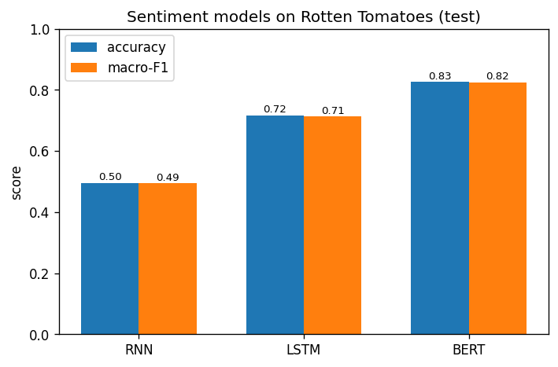

<div align="center">

</div>

# Sentiment Analysis — RNN vs LSTM vs DistilBERT

[](https://github.com/ashishlandiwal/sentiment-analysis-rnn-lstm-bert/actions/workflows/ci.yml)


A controlled comparison of three text-classification architectures on the same data: a
**from-scratch RNN**, a **from-scratch LSTM** (both PyTorch), and a **fine-tuned DistilBERT**
transformer. One pipeline, one train/test split, three models — so the numbers are directly
comparable and tell the story of how sequence modelling evolved.

## Results (Rotten Tomatoes test set, 1,066 reviews)

> Measured live by `python -m sentiment.compare`; values from committed
> [`reports/metrics.json`](reports/metrics.json).

| Model | Accuracy | Macro-F1 | Trained on |
|---|---|---|---|
| Vanilla RNN | 49.5% | 0.495 | 8,530 reviews |
| **LSTM** | **71.7%** | **0.713** | 8,530 reviews |
| **DistilBERT** (fine-tuned) | **82.6%** | **0.825** | 2,000 reviews, 2 epochs |

<p align="center"></p>

## What the numbers teach

- **The vanilla RNN sits at chance (~50%).** That isn't a bug — it's the textbook failure
  mode: across a ~40-token review the gradient to early words vanishes, and squeezing the
  whole sequence into one final hidden state loses the signal. This is *why* LSTMs exist.
  (Even with gradient clipping it won't budge much; mean-pooling or a bi-RNN would help.)
- **The LSTM works (~72%).** Gated memory preserves gradient flow, so it actually learns
  sentiment from the same data the RNN couldn't use.
- **DistilBERT wins decisively (~83%) on a quarter of the data.** Pre-training transfers an
  enormous amount of language understanding; fine-tuning on just 2,000 examples for 2 epochs
  beats the LSTM trained on all 8,530. This is the whole case for transfer learning in one row.

## Honesty note on scale

DistilBERT here is fine-tuned on a **2,000-example CPU-friendly subset for 2 epochs** so the
whole comparison reproduces on a laptop. On the full training set with a GPU it lands higher
(~88–90% is typical for DistilBERT on this dataset). The command is identical — just drop the
subset:

```bash
PYTHONPATH=src python -m sentiment.compare --bert-subset 8530 --bert-epochs 3
```

## How it works

- **Preprocessing (RNN/LSTM):** lowercase + regex tokenization, a frequency-pruned vocabulary
  built from the training set, integer encoding, and padding to a fixed length. OOV → `<unk>`.
- **Models (RNN/LSTM):** `Embedding → RNN/LSTM → dropout → linear`, trained with Adam,
  cross-entropy, and gradient clipping.
- **DistilBERT:** HuggingFace `AutoTokenizer` + `AutoModelForSequenceClassification`, fine-tuned
  with a manual AdamW loop (kept explicit rather than hidden behind `Trainer`).

## Quickstart

```bash
pip install -r requirements.txt              # RNN/LSTM + tests
pip install -r requirements-optional.txt     # transformers + datasets (for real data & BERT)

# RNN + LSTM only (no transformer download)
PYTHONPATH=src python -m sentiment.compare --skip-bert

# Full three-way comparison -> reports/metrics.json, comparison.png, model_card.md
PYTHONPATH=src python -m sentiment.compare

make test      # fast unit tests on a tiny bundled corpus (no downloads)
```

## Project structure

```
src/sentiment/
  data.py        # rotten_tomatoes loader + tiny offline corpus for tests
  vocab.py       # tokenizer + vocabulary for the RNN/LSTM path
  models.py      # SequenceClassifier (RNN | LSTM)
  train_rnn.py   # RNN/LSTM training loop (Adam + gradient clipping)
  train_bert.py  # DistilBERT fine-tuning (manual AdamW loop)
  evaluate.py    # metrics + comparison plot
  compare.py     # run all three on one split + CLI
  model_card.py  # auto-generated model card
reports/         # metrics.json, comparison.png, model_card.md (committed)
tests/
```

## Tech stack

Python · PyTorch · HuggingFace Transformers + Datasets · scikit-learn · matplotlib ·
pytest · ruff · Docker · GitHub Actions.

## License

MIT © Ashish Jangra
